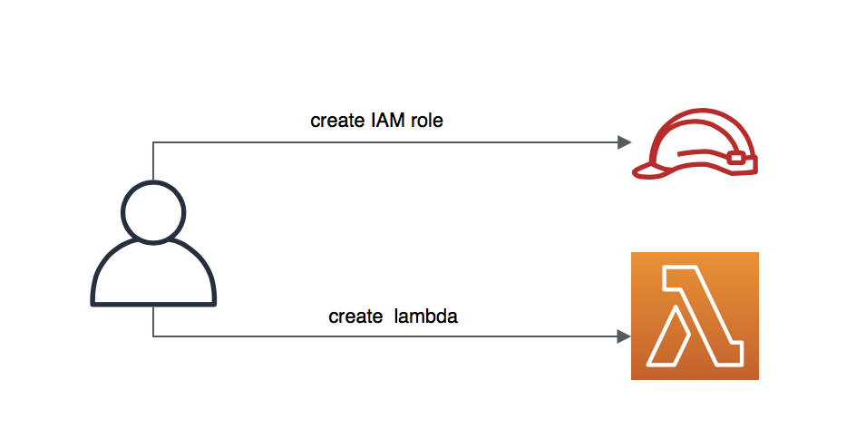
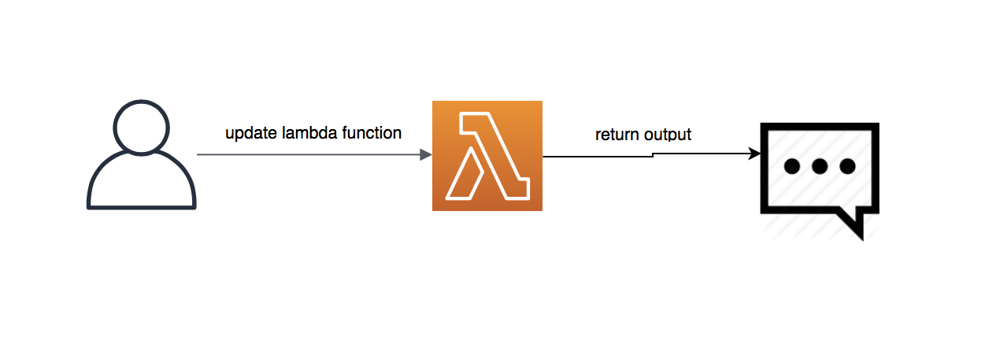

# Create & use lambda using aws-cli, all in one shell script
    
    $ cd example-5-hello-world-scripts

To create a new lambda and a role:

    $ . scripts/setup.sh function-name

To deploy a lambda and invoke it:

    $ . scripts/deploy.sh function-name '{"key1": "my-value"}'
    

Note: Don't forget to clean your stacks by executing:

    $ . scripts/clean.sh function-name
    
Note: to make a shell script executable, use:

    $ chmod +x scripts/deploy.sh  
    

## Takeaways:

- Use Shell Script to automate the deployment.
