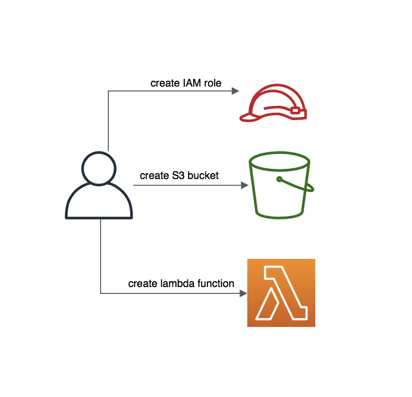
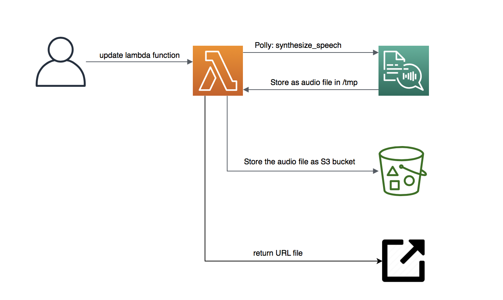

# Text to speech example, using boto3 (Python SDK) 
    
    cd example-6-polly

To create a new lambda, the role and the s3 bucket:

    . scripts/setup-polly.sh function-name my-unique-bucket-name

To deploy a lambda and invoke it:

    . scripts/deploy.sh function-name '{"bucket-name": "my-unique-bucket-name"}'

Note: for linux, try changing the script and use `base64 -d`

Copy the url to your browser and download the file! 

Note: Don't forget to clean your stacks by executing:

    . scripts/clean.sh function-name my-unique-bucket-name
